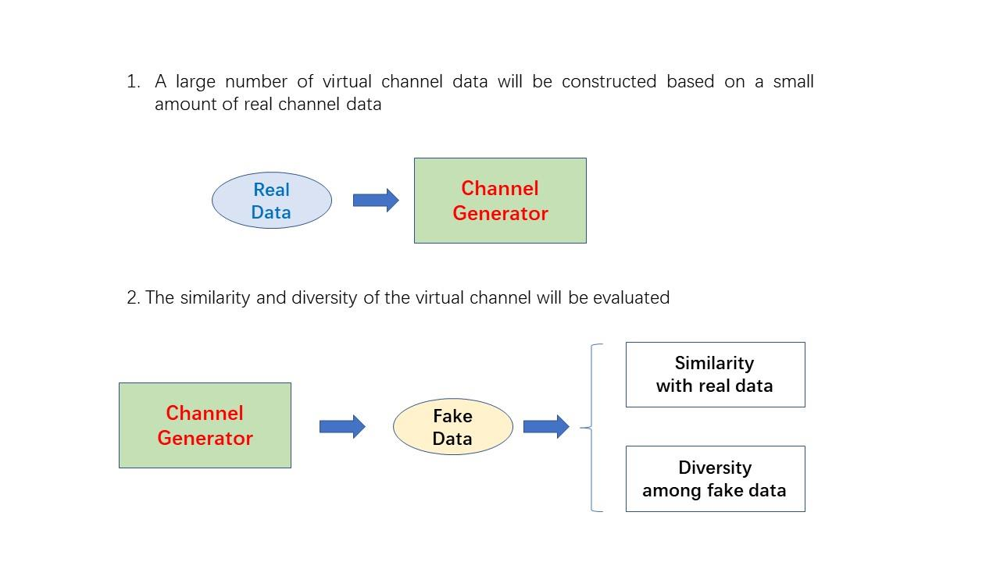
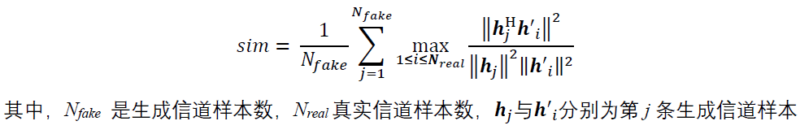
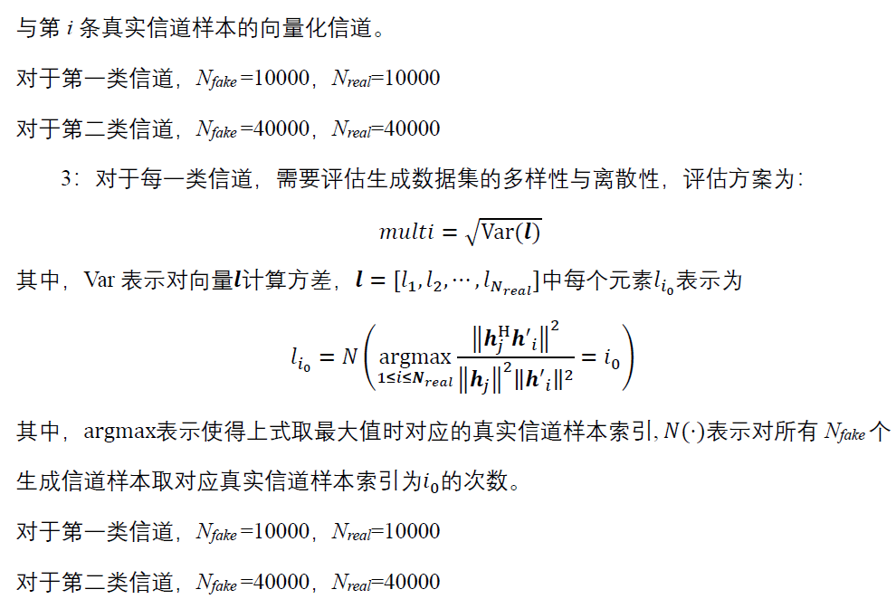
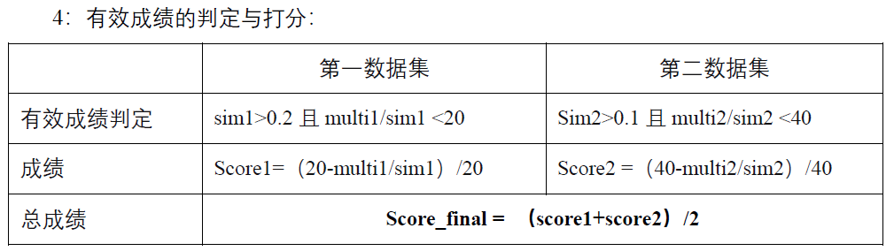

# channel_modeling
This repo is for 2022 6G AI channel modeling.

## DDL:
2022/03/11（24:00:00）： 评测结束，榜单锁定

## 推荐宏包版本：
Python 3.7；

tensorflow 2.4.2(2.1.0+)；

pytorch > 1.7.0；

Numpy 1.18.1；

h5py 2.10.0

上传文件大小限制：文件大小不得超过400MB；

数据生成时间限制：总时间不得超过400秒。

## 赛题任务

如图1所示，本赛题考虑利用AI的数据生成特性，

利用已知的小规模无线信道数据集，通过基于AI的数据生成方案，构建大规模无线信道数据集，

同时，综合考察生成的大规模数据集与真实数据的相似程度、离散程度。

具体来说，本赛题的特点如下：

a.通过基于AI的数据生成方案，实现基于小规模真实无线信道数据集的大规模生成无线信道数据集的构建

b.考察生成数据集分布与完整真实数据集分布的相似程度

c.考察生成数据集的多样性与离散型

d.本赛题需要在给定的两类信道数据集下，分别完成上述评价

（提示：第二类信道的复杂度高于第一类信道）

## Note:
本赛题支持TensorFlow及Pytorch两种版本结果的提交，

大赛提供二者的模板，两类版本均提供generatorFun.py文件作为参考，其中：

1.generatorFun.py：包含分别针对两类信道的生成函数generator1及generator2，用于评测平台调用。
特别地，生成器函数的输入变量为生成数据的数量、生成器模型文件及真实信道文件；生成器函数输出为对应数量的生成信道；

2.evaluation.py：用于评测生成结果有效性，该函数将调用generatorFun.py中定义的生成器函数generator_1和generator_2并分别生成信道数据fake_1与fake_2，
用于与真实数据对比，评估生成数据的性能与分数（线上评测将使用独立的真实数据集合）

进一步地，选手需将：

1.generatorFun.py

2.generator-1.h5（TensorFlow版本）或generator 1.pth.tar（Pytorch版本）

3.generator-2.hs（TensorFlow版本）或generator_2.pth.tar（Pytorch版本）

三项上传至平台评分系统，具体压缩打包规则见提交示例。

## 评分标准
1：选手需要在给定的两类信道环境下分别完成数据集生成模型的训练并提交模型，两类信道环境下可采用不同的数据生成方案。对于第一类信道不限制使用方案，对于第二类信道要求使用基于深度学习的生成模型（例如生成对抗网络、变分自编码器等）完成。

2：对于每一类信道，需要评估生成数据集分布与完整真实数据集分布的相似程度，评估方案为：

